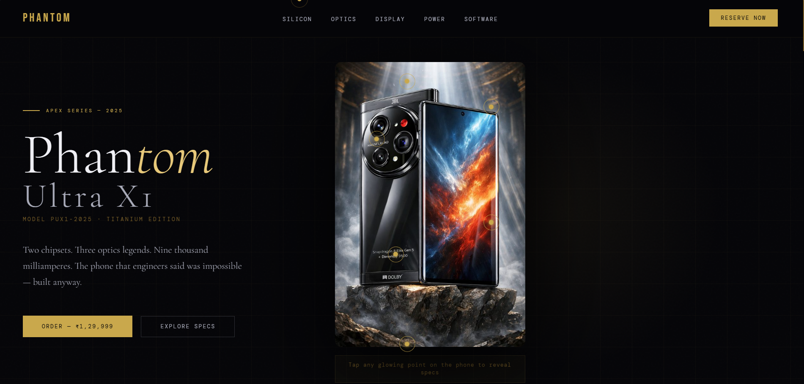
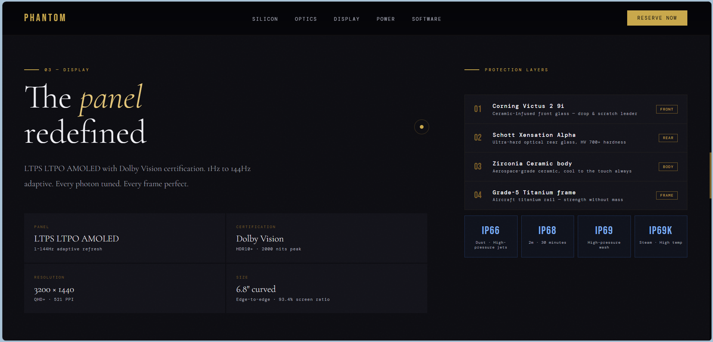
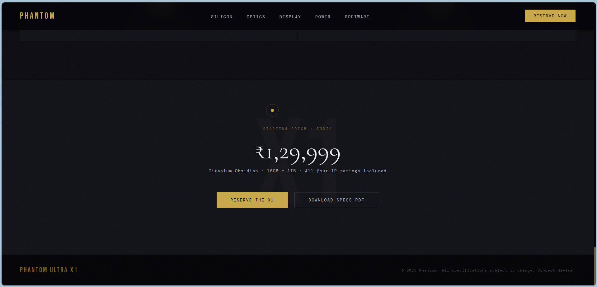

# Phantom Ultra X1 — Concept Product Experience

A high-end futuristic smartphone concept page designed to simulate a premium product launch experience with immersive UI and interactive elements.

---

## Live Demo

https://ffrshdd.github.io/phantom-x1-concept/

---

## Overview

Phantom Ultra X1 is not just a static webpage — it's an exploration of modern UI design, interaction, and visual storytelling inspired by flagship product presentations.

This project focuses on creating a *luxury digital experience* using only front-end technologies.

---

## Features

* Custom cursor system for immersive interaction
* Interactive hotspot system on product image
* Premium UI design (obsidian + gold aesthetic)
* Smooth animations and transitions
* Fully responsive layout
* Structured product sections (chipset, camera, display, power, software)

---

## Tech Stack

* HTML5
* CSS3 (advanced styling, animations, layout systems)
* Vanilla JavaScript (interaction handling)

---

## Preview

### Hero Section

### Features

### Full Page

---

## Purpose

This project was built to:

* Explore high-end product UI design
* Practice structured front-end architecture
* Create a visually rich and interactive web experience

---

## Future Improvements

* Add real device comparison section
* Improve performance optimization
* Add interactive buying flow
* Enhance mobile UX

---

## Run Locally

1. Download or clone the repository
2. Open `index.html` in your browser

---

## Author

Farshad 
